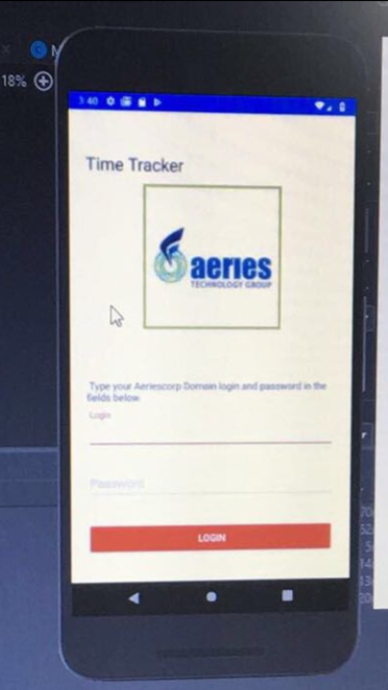

# AeriesTimeTrackerProject

* Built mobile application based on Java using
android studio to allow Aeries Hyderabad Office
to monitor employees and their performance
conveniently by phone.

* Designed mobile login activity and webview activity
and authenticated employee login details
via webview.

* Collected employee login credentials from
mobile login activity and injected javascript 
code to manipulate HTML elements in webview
to automatically log employee into webview
version of the website.

* Implemented features of webview to enable
seamless user experience of mobile app version
of the time-tracking web application.

LoginActivity.java & MainActivity.java @ app->src->main->java/com/sourcey/TimeTracker

App UI  files @ app->src->main->res

{:height="400px" width="300px"}

